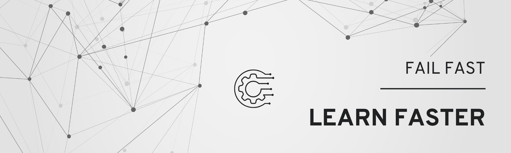

# Hi there, I'm Tony! 👋  

🚀 **Senior Full Stack Product Engineer** | 🦊 **AI & Interactive Systems** | ⚛️ **React & TypeScript** | ☁️ **Cloud Architecture**  

---

### 🔥 About Me  
I build **AI-powered products**, **interactive applications**, and **reliable cloud systems**—taking ideas from prototype to production.

With **10+ years in product engineering**, I turn complex workflows into useful experiences, owning technical design, launch, reliability, and iteration.  

---

### 🛠️ Tech Stack Highlights  
- **Frontend:** React, Next.js, TypeScript, Redux  
- **Backend:** Node.js, Python, FastAPI, Go, Java, REST, GraphQL, WebSockets  
- **AI:** OpenAI, Claude, structured outputs, model orchestration  
- **Data & Messaging:** PostgreSQL, Redis, Kafka, async queues  
- **Cloud & DevOps:** AWS, GCP, Docker, Kubernetes, Terraform, CI/CD  

---

### 🎯 Hobbies  
- 🔲 **Go** – Board Game Fun  
- ♟️ **Chess** – Thinking Ahead  
- 🍳 **Cooking** – Trying New Recipes  

---

### 📊 GitHub Stats  
  

